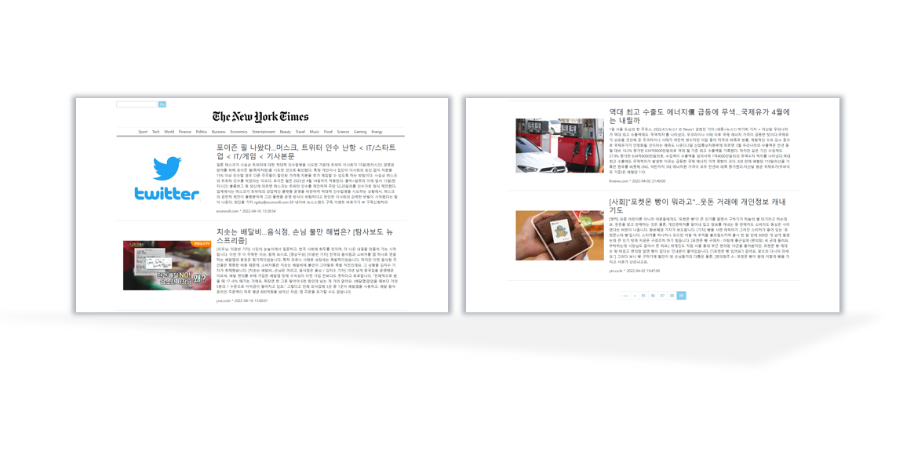

# NEWS-TIMES

The New York Times에서 영감을 받은 프로젝트입니다.

## 기능
- 뉴스 API를 이용해 나만의 뉴스 타임즈를 만들기
- async, await을 이용한 비동기 프로그래밍
- 검색된 데이터에 따라 try-catch를 이용한 에러 핸들링
- 카테고리별 / 키워드별 검색
- 페이지네이션 구현
- 반응형 UI

## 사용한 기술
- HTML
- CSS
- Vanila Javascript

